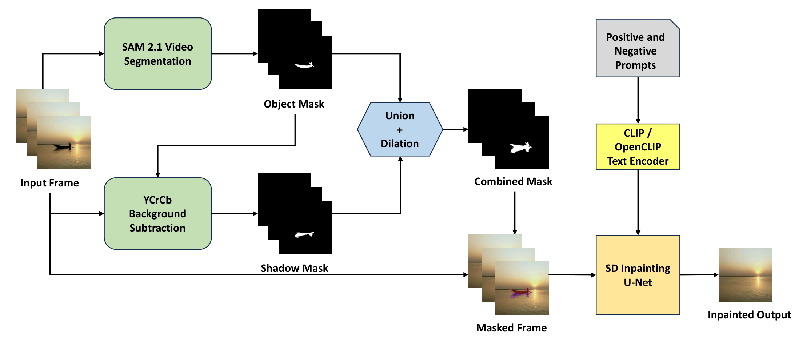
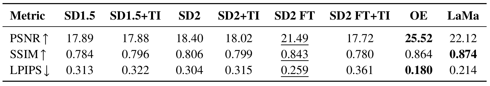
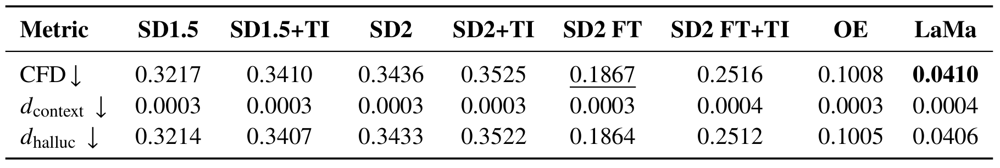

# Visual Effect-Aware Object Removal with Text-Guided Diffusion Inpainting

> **Master's Thesis** | Institute for Visualization and Interactive Systems, University of Stuttgart
>
> **Author:** Nikhil Bhavikatti  
> **Supervisor:** Xuening Tian, M.Sc.  
> **Examiner:** Prof. Dr. Dieter Schmalstieg  
> **Period:** November 2025 - May 2026

---

## Overview

Standard diffusion inpainting models fill masked regions with visually plausible content, but they routinely leave behind subtle residual traces, such as cast shadows, reflections, and surface interactions because these effects fall outside the object boundary and are never inpainted. This thesis presents **EADI (Effect-Aware Diffusion Inpainting)**, a framework that removes objects together with their associated visual effects (only cast shadows are addressed) by combining effect-aware masking, prompt engineering, textual inversion, and supervised U-Net fine-tuning on counterfactual image pairs.

---

## Key Contributions

1. **Combined Object-and-Shadow Masking Strategy:** A pixel-level union of a SAM 2.1 object mask and a YCrCb luminance-difference shadow mask, providing the inpainting model with the full contextual footprint of the removed object.
2. **Learned Shadow Token via Textual Inversion:** A pseudo-word token `<shadowobject>` trained on cropped shadow patches, used as negative prompt conditioning to instruct the model to suppress shadow-like content.
3. **Custom Effect-Aware Dataset:** 100 annotated indoor/outdoor video scenes with perfectly aligned counterfactual image pairs (object-present / object-absent), annotated with both SAM 2.1 object masks and explicit shadow masks. Split at the video level: **80 train / 10 val / 10 test**.
4. **Thorough Evaluation:** Six model variants and two external reference methods (LaMa, OmniEraser) compared on PSNR, SSIM, LPIPS, and CFD across 2,111 test image pairs.

---

## EADI Pipeline



---

## Model Variants

| Variant | Backbone | TI Token | Fine-tuned | Mask |
|---|---|---|---|---|
| SD1.5 Baseline | Stable Diffusion 1.5 | ✗ | ✗ | Combined |
| SD1.5 TI | Stable Diffusion 1.5 | ✔ | ✗ | Combined |
| SD2 Baseline | Stable Diffusion 2 | ✗ | ✗ | Combined |
| SD2 TI | Stable Diffusion 2 | ✔ | ✗ | Combined |
| SD2 Fine-tuned | Stable Diffusion 2 | ✗ | ✔ | Combined |
| SD2 Fine-tuned TI | Stable Diffusion 2 | ✔ | ✔ | Combined |

External references: LaMa (GAN lower bound) and OmniEraser (large-scale diffusion upper bound).

---

## Results




---

## Key Findings

- **Supervised fine-tuning is the decisive factor.** SD2 Fine-tuned achieves a +3.09 dB PSNR improvement and a 46% CFD reduction over the SD2 baseline.
- **Textual inversion learns shadow appearance but cannot override frozen priors.** TI variants slightly increase hallucination versus their respective baselines.
- **Combining TI with fine-tuning is counterproductive.** SD2 Fine-tuned TI is the worst-performing variant overall (PSNR 17.72 dB), as the learned negative token conflicts with the fine-tuned prior.
- **The shadow mask is essential.** Without it, the shadow footprint is presented to the U-Net as valid background and is never removed.
- **Scaling paired supervision remains the primary avenue for improvement**, as shown by OmniEraser's consistent lead across all metrics.

---

## Dataset

The dataset is publicly available on Kaggle: [VEAORWTGDI Dataset](https://www.kaggle.com/datasets/nikhilbhavikatti19/veaorwtgdi-dataset).

### Dataset Format

Each image entry is identified by a video ID and frame index, stored as flat files directly inside each split folder using the naming convention:

```
VXXX_YYYYY_B.jpg   ← Clean background frame (object-absent)
VXXX_YYYYY_I.jpg   ← Object-present frame (input)
VXXX_YYYYY_O.png   ← Binary object mask (SAM 2.1, Hiera-Large)
VXXX_YYYYY_S.png   ← Binary shadow mask (YCrCb luminance difference)
```

Where `XXX` is the video ID and `YYYYY` is the zero-padded frame index.

The dataset is organised into the following top-level folders:

```
dataset/
├── Train/             # 80 videos — flat files (B, I, O, S)
├── Validation/        # 10 videos — flat files (B, I, O, S)
├── Test/              # 10 videos — flat files (B, I, O, S)
├── Train_extra/       # Extra 40 videos — flat files (B, I, O, S)
├── COMPLETE_TEST/     # Same as Test + combined mask per entry
│                      #   VXXX_YYYYY_C.png ← Combined mask (OR of O + S, 5-iter dilated)
└── cropped_shadow_patches/    # Cropped shadow patches used for Textual Inversion token training
```

**Key properties:**

| Property | Value |
|---|---|
| Total videos | 140 (100 base + 40 extra) |
| Train / Val / Test split | 80 / 10 / 10 (video-level, no background leakage) |
| Train Extra | 40 additional videos |
| Total test image pairs | 2,111 |
| Frame format | JPEG (near-lossless), zero-indexed frame IDs |
| Object segmentation | SAM 2.1 Hiera-Large (single click per video, propagated) |
| Shadow detection | YCrCb brightness ratio with per-video `r_max` threshold |
| Annotation types | Background (B), Input (I), Object mask (O), Shadow mask (S), Combined mask (C) |
| Combined mask availability | COMPLETE_TEST folder only |
| Scene types | Indoor (self-recorded, controlled lighting) + Outdoor (stock footage) |

---

## Citation

If you use this work, please cite:

```bibtex
@mastersthesis{bhavikatti2026eadi,
  title     = {Visual Effect-Aware Object Removal with Text-Guided Diffusion Inpainting},
  author    = {Nikhil Bhavikatti},
  school    = {University of Stuttgart},
  year      = {2026},
  type      = {Master's Thesis},
  institute = {Institute for Visualization and Interactive Systems},
  university = {University of Stuttgart}
}
```

---

## Acknowledgements

This thesis was supervised by [Xuening Tian, M.Sc.](https://xueningtian.github.io/), and examined by [Prof. Dr. Dieter Schmalstieg](https://schmalstieg.github.io/) at the Institute for Visualization and Interactive Systems (VIS), University of Stuttgart. The fine-tuning training protocol follows [ObjectDrop (Winter et al., 2024)](https://objectdrop.github.io/). Shadow token learning follows [Textual Inversion (Gal et al., 2022)](https://textual-inversion.github.io/).